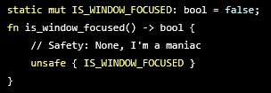
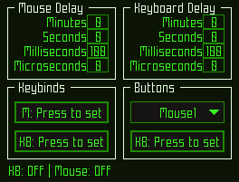

# rMultiClicker
Quick project, just a simple all-in-one clicker, using the raylib GUI. 

It has support for custom themes, that can be found [here](https://github.com/raysan5/raygui/tree/master/styles). Just pick a `.rgs` file, rename it to `style.rgs` and run your binary in the same directory as it.

### Common Issues:
- Adding accents ``á à ã â`` to letters may feel weird on Windows while the program is open.
- Windows defender might think it's sus, blame [rdev](https://crates.io/crates/rdev).
- Untested in `MacOS` & `Linux`.

It should work properly in Linux, if you're either using xorg or the target app is running with xwayland, but Mac? No idea yet.

### About the code:
 
Honestly, I did this as quick as possible, and I kind of wanted to see how far I could go just spamming `static mut`s and doing "unsafe" operations. Maybe I'll do a performance test against a "safe" version of it at some point, but that's not really in my priority list at the moment.

My old self would call this code a sin against humanity, but it actually paid off, since I would've spent 3x the time I did to actually finish this first commit.

### And here's a screenshot:

This uses the [terminal style](https://github.com/raysan5/raygui/tree/master/styles/terminal) from the raygui repo.
